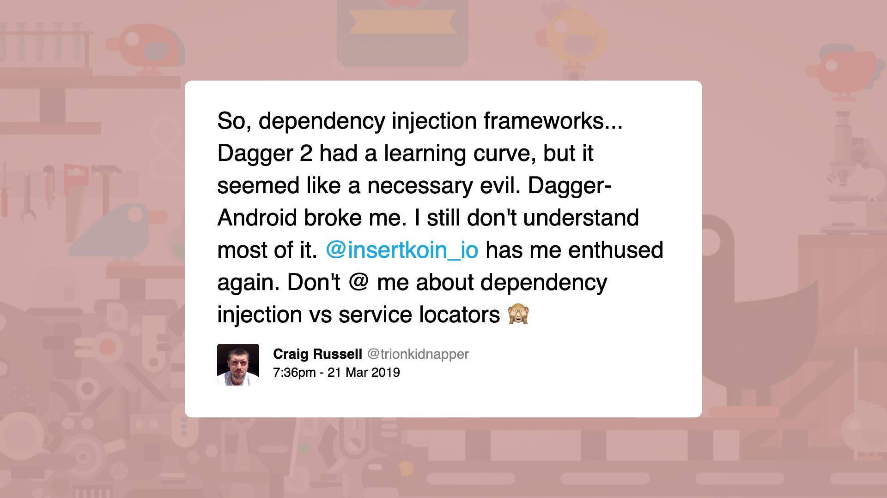
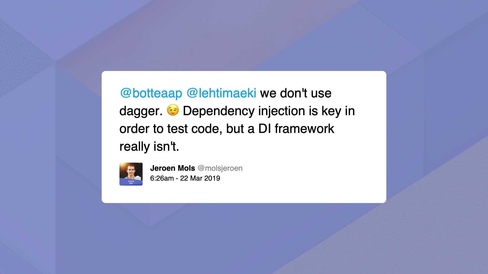
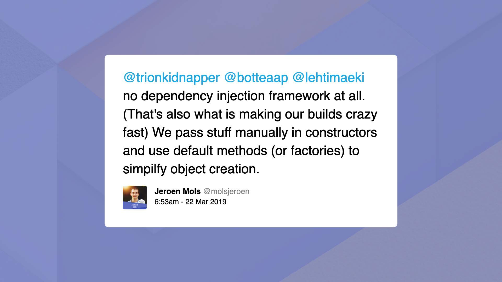
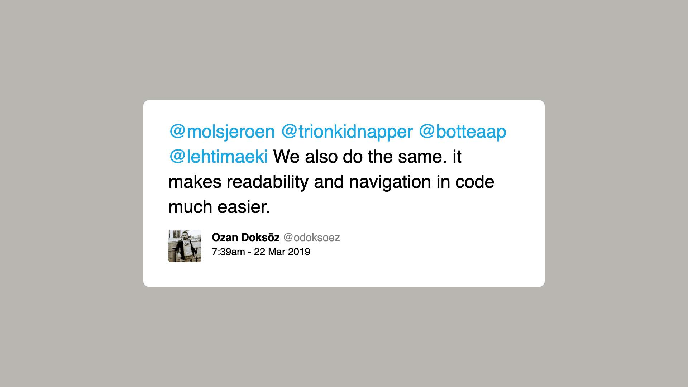
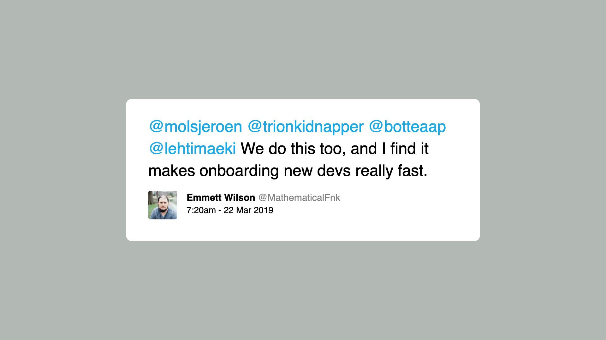
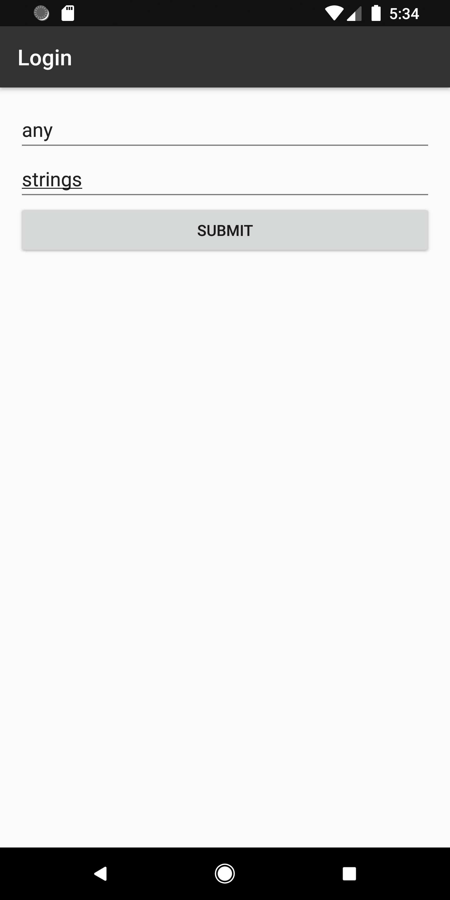
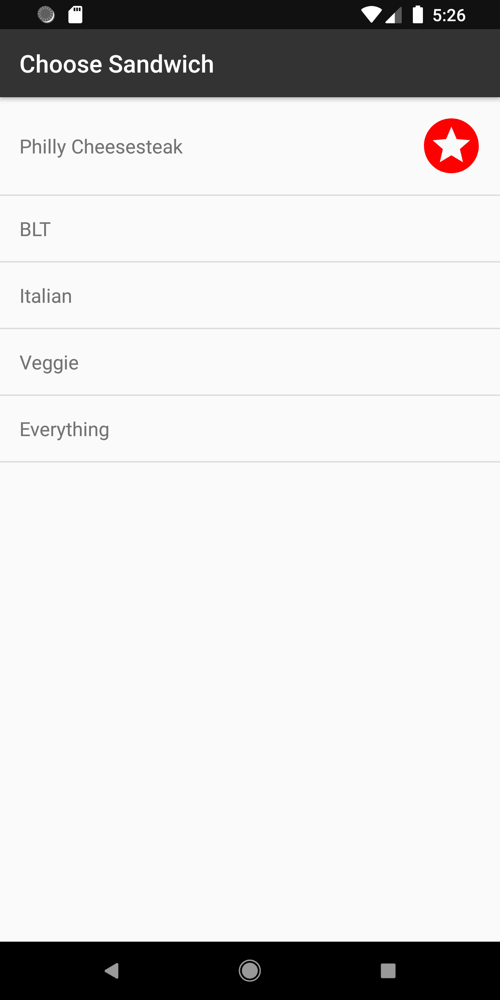
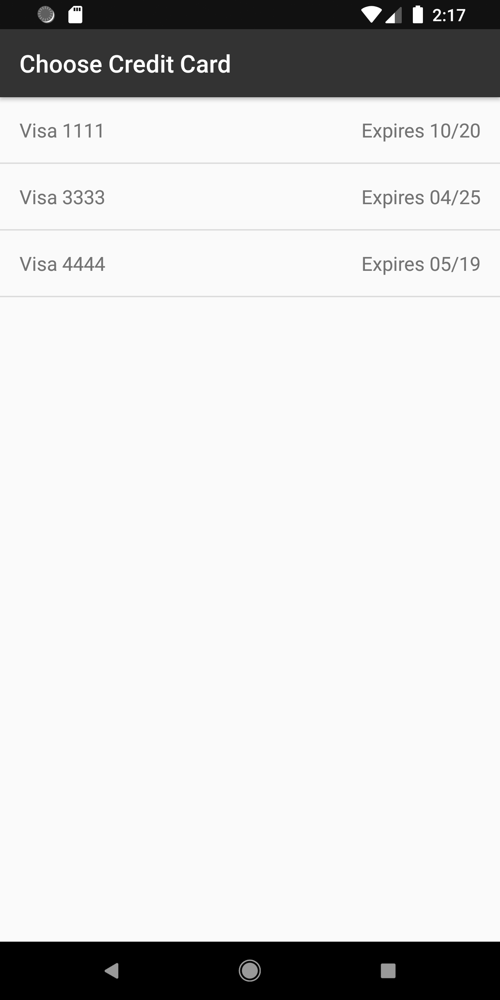
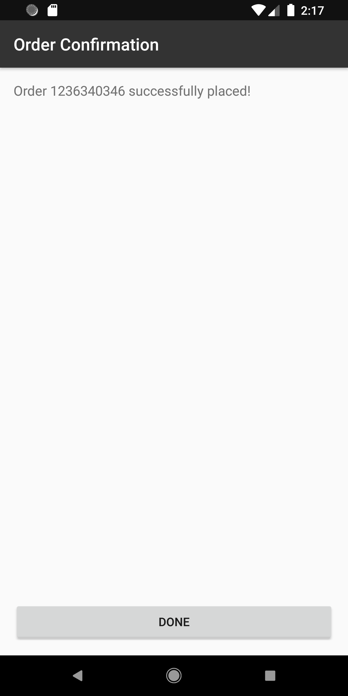

# Pragmatic Android Dependency Injection

---

# Workshop outline

- Theory talk (~45 minutes).
- Break.
- Guided app refactor (~ 2 hours).
- Wrap-up (5 minutes).

---

# Goals

- **Understanding** of DI principles and benefits.
- **Experience** adding manual DI to common architectures.
- **Awareness** of the costs/benefits of DI frameworks.

_I want this workshop to change how you write code._

---

# Talk

---

# What is a dependency?

When a class `C` uses functionality from a type `D` _to perform its own functions_, then `D` is called a **dependency** of `C`.

`C` is called a **consumer** of `D`.

^We also use the word dependency to mean "a third party library that our app consumes". The two usages describe the same concept applied at different scales (single class vs entire application).

---

# Why do we use dependencies?

- To share logic and keep our code **DRY**.
- To model logical abstractions, **minimizing cognitive load**.

^Having/creating/maintaining dependencies is a good and natural part of developing well-organized, maintainable software. We want to keep using them while minimizing the drawbacks that we'll uncover shortly.

---

# A consumer/dependency example

[.code-highlight: all]
[.code-highlight: 1, 8]
[.code-highlight: 2, 9]

```java
public class TimeStamper {          // Consumer
  private SystemClock systemClock;  // Dependency
    
  public TimeStamper() {
    systemClock = new SystemClock();
  }
    
  public String getTimeStamp() {
    return "The time is " + systemClock.now();
  }
}
```

^In this example, the `TimeStamper` class is our consumer. Its capabilities include providing collaborators with a nicely-formatted timestamp, e.g. "The time is 12:34". In order to build this timestamp, the `TimeStamper` class uses functionality from a `SystemClock` instance; namely, the ability to fetch the current time, e.g. "12:34". The `SystemClock` instance is therefore a dependency of `TimeStamper`.

---

# Android consumers

In Android, **important consumers** include:

- activities/fragments,
- _presenters/view models._

These classes are the hearts of our apps. Their capabilities include transforming app state into UI state, processing user input, coordinating network requests, and applying business rules. **Testing them is valuable!**

^These are not the only consumers you'll find in Android apps, and they're not the only consumers worth testing. But they usually house significant amounts of application logic and so are some of the first classes to consider testing.

^Unit testing activities and fragments will be hard even if you add DI, because they are tightly coupled to the Android framework, and framework-replacement testing tools like Robolectric have historically been fragile. For this reason, I would normally prioritize refactoring to use presenters or view models before thinking about adding DI. We'll do this in the guided refactor later.

---

# Android dependencies

In Android, **common dependencies** include:

- API clients,
- local storage,
- clocks,
- geocoders,
- user sessions.

^A lot of these examples depend on "external resources" (e.g. network connectivity; device hardware; system timezone settings). Such dependencies are impure/volatile (since their behavior may vary over time), which makes it especially important that we figure out how to replace them with mocks that behave predictably for unit tests. More on this later.

---

# Android consumer/dependency examples

- A login **fragment** that uses an _API client_ to submit user credentials to a backend.
- A choose sandwich **presenter** that uses _local storage_ to track the last sandwich ordered.
- A choose credit card **view model** that uses a _clock_ to determine which cards are expired.

---

# Dependency dependencies

Some classes act as **both** consumers and dependencies.
<br />
Example: an API client may consume a class that assists with local storage (for caching) **and** be consumed by presenters.
<br />
The relationships between all dependencies in an app are collectively referred to as the **dependency graph**.

^We're not going to discuss dependency graphs in any great detail, but the phrase crops up frequently in DI discussions so it's good to be aware of what they are.

---

# Mommy, where do dependencies come from?

- _Consumers_ create dependencies themselves (**hard-coded**).
- _Consumers_ ask an external class for their dependencies (**service locator**).
- _An external class_ injects a consumer's dependencies via constructors or setters (**dependency injection**).

^By default, most folks writing untested code will hard-code their dependencies and feel little to no pain.

^The service locator pattern is a big improvement over hard-coding, but DI is still preferred.

---

# Hard-coded dependencies, v1

[.code-highlight: all]
[.code-highlight: 4-6]

```java
public class TimeStamper {
  private SystemClock systemClock;
    
  public TimeStamper() {
    systemClock = new SystemClock();
  }
    
  public String getTimeStamp() {
    return "The time is " + systemClock.now();
  }
}
```

^The use of a constructor (equivalently, the `new` keyword) can signal a hard-coded dependency. Note that some non-dependency "glue" code (e.g. lists used for temporary storage) will also be instantiated using constructors, so deeper introspection is required to determine whether the instantiated object plays a significant role in the functionality of the consumer or not. This is a bit of an art.

---

# Hard-coded dependencies, v2

[.code-highlight: all]
[.code-highlight: 3]

```java
public class TimeStamper {
  public String getTimeStamp() {
    return "The time is " + new SystemClock().now();
  }
}
```

^It doesn't matter _where_ a consumer calls the constructor of a dependency; whether up front (in its own constructor) or on-demand (e.g. in a method body, as in this example) - it's hard-coding either way.

---

# Hard-coded dependencies, v3

[.code-highlight: all]
[.code-highlight: 3]

```java
public class TimeStamper {
  public String getTimeStamp() {
    return "The time is " + SystemClock.shared().now();
  }
}
```

^Accessing a singleton instance directly is also considered to be hard-coding. This is slightly less tight coupling than calling a constructor directly, but causes other unit testing difficulties that we will explore more shortly.

---

# Hard-coded dependencies, v4

[.code-highlight: all]
[.code-highlight: 3]

```java
public class TimeStamper {
  public String getTimeStamp() {
    return "The time is " + SystemClock.now();
  }
}
```

^Calling a static method is also considered to be hard-coding.

---

# Hard-coding hardships

A consumer's dependencies are **hidden**:
<br />

```java
// Dependency on SystemClock is invisible:
TimeStamper timeStamper = new TimeStamper();
System.out.println(timeStamper.getTimeStamp());
```

^Users of the `TimeStamper` class have no way of easily determining which other app components it uses.

---

# Hard-coding hardships

A consumer with _impure_ dependencies will be **very hard to unit test at all**:
<br />

```java
public class TimeStamperTest {
  @Test
  public String testGetTimeStamp() {
    String expected = "The time is 12:34";
    String actual = new TimeStamper().getTimeStamp();
    assertEquals(expected, actual); // Almost always fails.
  }
}
```

^Users of the `TimeStamper` class have no way of testing the `getTimeStamp` logic separately from the `SystemClock` logic. This means writing a reliable unit test for `getTimeStamp` is impossible!

---

# Hard-coding hardships

A consumer that hard-codes access to _singletons_ may have **brittle/slow/lying unit tests** (if state leaks between tests).

^This can be worked around in ugly ways, by e.g. manually resetting the states of _all_ singletons in your app in between every unit test, but it's easy to forget to update when you add a new singleton.

---

# Improving on hard-coding

* Make consumer dependency needs **explicit** (by receiving instances through constructors or setters).
    _=> Also decouples consumer from dependency lifetime._
* Express dependency needs using **interfaces (behaviors)** rather than classes (implementations).
    _=> Allows mock implementations to be supplied in unit tests._

These are the elements of robust **dependency injection**!

^We haven't discussed all the implementation details yet, e.g. who creates/injects dependencies to fulfill consumer needs, but the essential ideas are in place!

---

# Doing DI: Before

```java
public class TimeStamper {
  private SystemClock systemClock;
    
  public TimeStamper() {
    systemClock = new SystemClock();
  }
    
  public String getTimeStamp() {
    return "The time is " + systemClock.now();
  }
}
```

---

# Doing DI: Before

```java
public class SystemClock {
  public String now() {
    return LocalDateTime
        .now()
        .format(DateTimeFormatter.ofPattern("hh:mm"));
  }
}
```

---

# Doing DI: Identifying dependencies

```java
public class TimeStamper {
  private SystemClock systemClock;
    
  public TimeStamper() {
    systemClock = new SystemClock();
  }            // ^^^^^^^^^^^^^^^^^ A (hard-coded) *dependency*!

  public String getTimeStamp() {
    return "The time is " + systemClock.now();
  }
}
```

^This class exhibits one of the hard-coded dependency patterns we identified earlier.

---

# Doing DI: Identifying behaviors

```java
public class TimeStamper {
  private SystemClock systemClock;
    
  public TimeStamper() {
    systemClock = new SystemClock();
  }

  public String getTimeStamp() {
    return "The time is " + systemClock.now();
  }                      // ^^^^^^^^^^^^^^^^^ The *behavior* we rely on.
}
```

^The `TimeStamper` class requires a dependency with the ability to provide the current clock time (via a method named `now`).

---

# Doing DI: Defining interfaces

```java
// Describes the *behavior* our consumer relies on:
public interface IClock {
  String now();
}

// Is now one possible supplier of IClock behavior:
public class SystemClock implements IClock {
  @Override
  public String now() {
    return LocalDateTime
        .now()
        .format(DateTimeFormatter.ofPattern("hh:mm"));
  }
}
```

^The `IClock` interface perfectly describes the clock-related needs of the `TimeStamper` class identified in the previous slide. The original `SystemClock` class is updated to become one implementation of the `IClock` interface.

---

# Doing DI: Demanding dependencies (constructor)

[.code-highlight: all]
[.code-highlight: 4]
[.code-highlight: 2, 5]
[.code-highlight: 9]

```java
public class TimeStamper {
  private IClock clock;
    
  public TimeStamper(IClock clock) {
    this.clock = clock;
  }
    
  public String getTimeStamp() {
    return "The time is " + clock.now();
  }
}
```

^This is a common method of injecting dependencies. The `TimeStamper` class is updated to require an `IClock` instance be passed to its constructor, and then saves this instance into a field (of updated type `IClock`) as before. `TimeStamper` now has no idea that `SystemClock` exists.

---

# Doing DI: Demanding dependencies (setter)

[.code-highlight: all]
[.code-highlight: 4]
[.code-highlight: 2, 5]
[.code-highlight: 9]

```java
public class TimeStamper {
  private IClock clock;
    
  public void setClock(IClock clock) {
    this.clock = clock;
  }
    
  public String getTimeStamp() {
    return "The time is " + clock.now();
  }
}
```

^If a dependency is not available for injection when a consumer is created, we can inject later via a setter instead. I prefer constructor injection where possible as you can then be sure all dependencies are always initialized.

---

# Doing DI: Manual injection

**Owners** of consumers create/locate and inject dependencies:

```java
// Constructor injection in production code:
TimeStamper timeStamper = new TimeStamper(new SystemClock());
System.out.println(timeStamper.getTimeStamp());
```

^In production code, it is the responsibility of each class that constructs a `TimeStamper` to decide which `IClock` implementation should be injected. In most apps there is exactly one production implementation of most dependency interfaces. Here, we choose the `SystemClock` implementation.

---

# Doing DI: Manual injection

```java
// Mock clock created for use during tests:
public class MockClock implements IClock {
  private String fixedTime;
  
  public MockClock(String fixedTime) {
    this.fixedTime = fixedTime;
  }

  @Override
  public String now() {
    return fixedTime;
  }
}
```

^It is now possible to create alternative implementations of the `IClock` interface, like this `MockClock` that always returns a fixed time. This repeatability in combination with dependency innjection will allow us to write a reliable unit test for `TimeStamper` (next slide).

---

# Doing DI: Manual injection

```java
// Constructor injection in test code:
public class TimeStamperTest {
  @Test
  public String testGetTimeStamp() {
    String expected = "The time is 12:34";
    IClock mockClock = new MockClock("12:34");
    String actual = new TimeStamper(mockClock).getTimeStamp();
    assertEquals(expected, actual); // Always passes.
  }
}
```

^By injecting a `MockClock` with fixed time "12:34" in test code, the expected result of `TimeStamp::getTimeStamp` is now consistent and we can write assertions against it.

---

# Doing DI: Manual injection

- ✅ Simplest injection technique.
- ✅ Dependency lifetimes controlled using familiar methods.
- ✅ Sufficient for all unit testing needs.
- ❌ Repetitive.
- ❌ Can scale poorly if your dependency graph is deep
    e.g. `new D1(new D2(new D3(...), ...), ...)`.
- ❌ Insufficient for reliable UI testing.

^While repetitive, manual DI is normally not difficult to implement correctly because of this fact from earlier: "In most apps there is exactly one production implementation of most dependency interfaces." In addition, if you're using Kotlin, you can leverage default parameter values to automatically inject production dependencies by default, and only explicitly specify alternatives in test code.

---

# Doing DI: Framework injection

Most Java/Kotlin DI frameworks are structured similarly:

- Centralized code describes the entire dependency graph
- Consumers add `@Inject` annotations to their dependencies
- Classes call an `inject` method to trigger injection

The details are (much) more complicated, but that's the gist.

---

# Doing DI: Framework injection

- ✅ DRY.
- ✅ Makes dependency graph very explicit.
- ✅ Sufficient for all unit testing needs.
- ✅ Sufficient for all UI testing needs.
- ❌ Frameworks are difficult to learn and use effectively.
- ❌ Dependency lifetime management can get complicated.
- ❌ Longer build times/some performance impact.

^Popular frameworks include Dagger 2 and Koin.

---

# I say...

Use a framework if:

- your app needs extensive UI test coverage
- your app has a deep dependency graph
- your app swaps dependency implementations at runtime
- you are already comfortable with DI principles

Otherwise, **prefer manual constructor injection.**

---

# The community says...
⠀

---



---



---



---



---



^Dagger is notoriously tough to wrangle. I haven't used Koin yet.

---

# </talk>
# Questions?

---

# Guided App Refactor

---

# Speedy Subs

Speedy Subs is a small sandwich-ordering app.

Each major screen is structured differently (MVC vs MVP vs MVVM).

We will refactor each screen to allow unit testing via DI.

---



# Login

* MVC (fat Fragment)
* **Username is validated**
* **Password is validated**
* _Login request is made on submit_
* Choose Sandwich screen is launched on success

---



# Choose Sandwich

* MVP
* _Sandwiches are fetched from network on screen launch_
* **Last-ordered sandwich is listed first**
* **Other sandwiches are listed in order received**
* Choose Credit Card screen is launched on row tap

---



# Choose Credit Card

* MVVM (w/ LiveData)
* Credit cards are initially populated from login response
* _Screen implements pull-to-refresh_
* **Only non-expired credit cards are listed**
* _Order is submitted on row tap_
* Confirmation screen is launched on success

---



# Confirmation

* Back and Done buttons return us to the login screen.

---

# Key classes

- `MainActivity`: application entry point.
- `Session`: stores info about the current customer and order.
- `OrderingApi`: group of methods for calling (fake) backend. Simulates delayed network responses.

---

# Ready, set, refactor

^Head on over to the part2-refactor directory and follow the guide there; return to these slides when you've completed the refactor!

---

# Wrap-up

---

# DI IRL

- Refactor to MV(something) first.
- Plan to implement DI progressively.
- Focus on areas in need of tests (important + fragile).
- Start manual, swap to a framework if needed.

---

# Further learning

- (talk) [Dependency Injection Made Simple](https://academy.realm.io/posts/daniel-lew-dependency-injection-dagger/) by [Dan Lew](https://twitter.com/danlew42)
- (book) [Dependency Injection Principles, Practices, and Patterns](https://www.manning.com/books/dependency-injection-principles-practices-patterns) by [Steven van Deursen](https://twitter.com/dot_NET_Junkie) and [Mark Seemann](https://twitter.com/ploeh)
