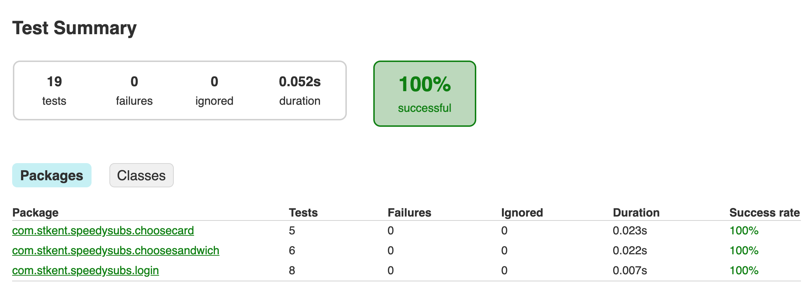

# Before we begin...

- Run the app and spend 15 minutes exploring its functionality and looking through the codebase.
- You may find it useful to [enable automatic insertion of unambiguous imports](https://www.jetbrains.com/help/idea/creating-and-optimizing-imports.html#automatically-add-import-statements) in Android Studio.

# `LoginFragment`

This screen is architected using MVC (all logic lives in the fragment). Per the recommendations in the slide deck, we will first refactor to MVP, and then refactor again to inject dependencies.

**Refactor to MVP**

- In the `login` package: create an interface named `ILoginView`:
    ```java
    package com.stkent.speedysubs.login;

    public interface ILoginView {
    
        void showProgressIndicators(boolean show);
        void goToChooseSandwichScreen();
        void displayError(@NonNull String message);

    }
    ```

    This should look familiar! We're defining an interface that captures the **behaviors** of the view that the presenter will interact with, so that we may replace the implementation for testing. In other words, we are defining a dependency ready to inject it!

- In the `LoginFragment` class: implement the `ILoginView` interface:
    ```java
    public final class LoginFragment extends Fragment implements ILoginView {
    
        //...
    
        @Override
        public void showProgressIndicators(final boolean show) {
            progressIndicator.setVisibility(show ? VISIBLE : GONE);
        }
    
        @Override
        public void goToChooseSandwichScreen() {
            getFragmentManager()
                    .beginTransaction()
                    .replace(R.id.fragment_container, new SandwichFragment())
                    .addToBackStack(null)
                    .commitAllowingStateLoss();
        }
    
        @Override
        public void displayError(@NonNull final String message) {
            Toast.makeText(getContext(), message, LENGTH_SHORT).show();
        }
    
    }
    ```

    `LoginFragment` is now a concrete implementation of the `ILoginView` behaviors.

- In the `login` package: create a class named `LoginPresenter`:
    ```java
    package com.stkent.speedysubs.login;

    final class LoginPresenter {
    
        @NonNull
        private final ILoginView view;

        LoginPresenter(@NonNull final ILoginView view) {
            this.view = view;
        }

        void onSubmitTapped(
                @NonNull final String username,
                @NonNull final String password) {


        }

    }
    ```

    We are injecting an `ILoginView` interface via the constructor.

- In the `LoginFragment` class: add a new field of type `LoginPresenter` and initialize it in `onCreate`:
    ```java
    //...

    private LoginPresenter presenter;

    @Override
    public void onCreate(@Nullable final Bundle savedInstanceState) {
        super.onCreate(savedInstanceState);
        presenter = new LoginPresenter(this);
    }

    //...
    ```

- Copy the entire contents of the `onClick` method from the `LoginFragment` class into the `onSubmitTapped` method of the `LoginPresenter` class. You will see lots of red errors! Resolve them as follows:
    - Delete the line `final String username = ...`.
    - Delete the line `final String password = ...`.
    - Replace all occurrences of `Toast.makeText(getContext(), ..., LENGTH_SHORT);` with `view.displayError(...)`.
    - Replace all occurrences of `progressIndicator.setVisibility(VISIBLE);` with `view.showProgressIndicators(true);`.
    - Replace all occurrences of `progressIndicator.setVisibility(GONE);` with `view.showProgressIndicators(false);`.
    - Replace the block
        ```java
        getFragmentManager()
                .beginTransaction()
                .replace(R.id.fragment_container, new SandwichFragment())
                .addToBackStack(null)
                .commitAllowingStateLoss();
        ```
        with `view.goToChooseSandwichScreen();`.

- In the `LoginFragment` class: update the `submitButton` `OnClickListener` to call the `LoginPresenter::onSubmitTapped` method only:
    ```java
    submitButton.setOnClickListener(new View.OnClickListener() {
        @Override
        public void onClick(final View v) {
            presenter.onSubmitTapped(
                    usernameField.getText().toString(),
                    passwordField.getText().toString());
        }
    });
    ```

We have now moved all business logic from the fragment into the presenter and introduced and injected an interface so the view can be mocked for tests. This is great progress, but we're not quite ready to write unit tests yet. To do that, we need to identify and inject all other dependencies.

**Identify hard-coded presenter dependencies**

- In the `LoginPresenter` class: comparing our code to examples of hard-coded dependencies from the slides, we find the following hard-coded dependencies:
    - `OrderingApi` (via a call to `new OrderingApi()`).
    - `Session` (via calls to `Session.getSharedInstance()`).

**Create interfaces describing idealized dependency behaviors**

- In the `networking/ordering` package: create an interface named `IOrderingApi`:
    ```java
    package com.stkent.speedysubs.networking.ordering;

    public interface IOrderingApi {
    
        void logIn(
                @NonNull String username,
                @NonNull String password,
                @NonNull Callback<Customer> callback);

        void getCustomerCreditCards(
                @NonNull Callback<List<CreditCard>> callback);
                
        void getSandwiches(
                @NonNull Callback<List<Sandwich>> callback);
        
        void placeOrder(
                @NonNull Customer customer,
                @NonNull Order order,
                @NonNull Callback<Integer> callback);

    }
    ```

    In this case we have chosen to prioritize cohesion over interface segregation by including all existing public methods of `OrderingApi` in our `IOrderingApi` interface. We will see the benefit of this choice when refactoring the next two screens, where we will be able to reuse the `IOrderingApi` interface as-is rather than polluting our app with many similar API-related interfaces. Our method names are already domain-appropriate since `OrderingApi` is an implementation we created.

- In the `OrderingApi` class: implement the `IOrderingApi` interface. (Don't forget to add `@Override` annotations where appropriate.)

- In the `state` package: create an interface named `ISession`:
    ```java
    package com.stkent.speedysubs.state;

    public interface ISession {
    
        @Nullable
        Customer getCustomer();

        @Nullable
        Order getOrder();
        
        void setCustomer(@NonNull Customer customer);
        void clearCustomer();
        void setOrder(@NonNull Order order);
        void clearOrder();

    }
    ```

    Again, we include all public `Session` methods in this interface to maintain high cohesion. Our method names are already domain-appropriate since `Session` is an implementation we created.

- In the `Session` class: implement the `ISession` interface. (Don't forget to add `@Override` annotations where appropriate.)

**Manually inject dependencies into presenter**

- In the `LoginPresenter` class: add new fields of types `ISession` and `IOrderingApi` and initialize them in the constructor:
    ```java
    @NonNull
    private final ILoginView view;

    @NonNull
    private final IOrderingApi orderingApi;

    @NonNull
    private final ISession session;

    LoginPresenter(
            @NonNull final ILoginView view,
            @NonNull final IOrderingApi orderingApi,
            @NonNull final ISession session) {

        this.view = view;
        this.orderingApi = orderingApi;
        this.session = session;
    }
    ```

    We're now requiring that collaborators inject our dependencies!

- In the `LoginPresenter` class:
    - Replace all occurrences of `new OrderingApi()` with `orderingApi`.
    - Replace all occurrences of `Session.getSharedInstance()` with `session`.

- In the `LoginFragment` class: fix the error in the line `presenter = new LoginPresenter(this);` by injecting the newly-required dependencies:
    ```java
    presenter = new LoginPresenter(this, new OrderingApi(), Session.getSharedInstance());
    ```

**Inspect pre-written test suite**

Open the class `LoginPresenterTest`. You should not see any errors (if you do, double-check that you performed all previous steps accurately.)

The structure of each test is roughly as follows:
- Use [Mockito](https://site.mockito.org/) to create mock implementations of any dependency interfaces we need.
- Create a real `LoginPresenter` instance, with all dependencies satisfied using mock implementations.
- Configure the mock implementations with the responses required for the current test scenario.
- Call the presenter method whose behavior we are currently testing.
- Check that mock implementation methods were called the expected number of times with the expected arguments.

Since this is a class on DI, rather than unit testing, I won't say any more about the test details. But notice how detailed and granular we are able to make these tests, and how clearly each scenario is defined and exercised. **That's** why we DI.

**Check your work**

Run the app. You should see no behavioral changes!

# `SandwichFragment`

**Identify hard-coded presenter dependencies**

- In the `SandwichPresenter` class: comparing our code to examples of hard-coded dependencies from the slides, we find the following hard-coded dependencies:
    - `OrderingApi` (via a call to `new OrderingApi()`).
    - `Session` (via a call to `Session.getSharedInstance()`).
    - `SharedPreferences` (via calls to `context.getSharedPreferences`).

    We have already created an `IOrderingApi` interface describing the behavior of the concrete `OrderingApi` class and an `ISession` interface describing the behavior of the concrete `Session` class. Our dependency on `SharedPreferences` is new and we must make a new interface to describe the functionality it provides us.
    
    We do not own the `SharedPreferences` type, so its public API is much larger and much less domain-specific than our other concrete dependency implementations. This is a good opportunity to define our own ideal API instead, and hide all the unneeded complexity of the `SharedPreferences` API from our consumers.

    `SandwichPresenter` uses `SharedPreferences` for two things: saving the id of the favorite sandwich, and retrieving the id of the saved favorite sandwich. The interface we define in the next step will include one appropriately-named method for each of these behaviors.

**Create interfaces describing (new) idealized dependency behaviors**

- Make a new `persistence` package inside the `com.stkent.speedysubs` package.

- In the `persistence` package: create an interface named `IFaveStorage`:
    ```java
    package com.stkent.speedysubs.persistence;

    public interface IFaveStorage {
    
        void setFavoriteSandwichId(int id);
        int getFavoriteSandwichId();

    }
    ```

    This custom role interface (1) is much smaller than the large public API of `SharedPreferences`, and (2) uses domain-specific naming (vs the domain-agnostic naming of `SharedPreferences`). Both are wins when it comes to understanding and testing our code.

- In the `persistence` package: create a class named `SharedPrefsFaveStorage` that implements `IFaveStorage` using a backing `SharedPreferences` instance:
    ```java
    package com.stkent.speedysubs.persistence;

    public final class SharedPrefsFaveStorage implements IFaveStorage {
    
        private static final String PREFS_NAME = "FAVE_STORAGE";
        private static final String FAVE_ID_KEY = "FAVE_ID";
    
        @NonNull
        private final SharedPreferences sharedPreferences;
    
        public SharedPrefsFaveStorage(@NonNull final Context context) {
            this.sharedPreferences = context.getSharedPreferences(PREFS_NAME, Context.MODE_PRIVATE);
        }
    
        @Override
        public void setFavoriteSandwichId(final int id) {
            sharedPreferences
                    .edit()
                    .putInt(FAVE_ID_KEY, id)
                    .apply();
        }
    
        @Override
        public int getFavoriteSandwichId() {
            return sharedPreferences.getInt(FAVE_ID_KEY, -1);
        }
    
    }
    ```

**Manually inject dependencies into presenter**

- In the `SandwichPresenter` class: add new fields of types `IOrderingApi`, `ISession`, and `IFaveStorage`, and initialize them in the constructor:
    ```java
    @NonNull
    private final ISandwichView view;

    @NonNull
    private final IOrderingApi orderingApi;

    @NonNull
    private final ISession session;

    @NonNull
    private final IFaveStorage faveStorage;

    SandwichPresenter(
            @NonNull final ISandwichView view,
            @NonNull final IOrderingApi orderingApi,
            @NonNull final ISession session,
            @NonNull final IFaveStorage faveStorage) {

        this.view = view;
        this.orderingApi = orderingApi;
        this.session = session;
        this.faveStorage = faveStorage;
    }
    ```

- In the `SandwichPresenter` class:
    - Replace all occurrences of `new OrderingApi()` with `orderingApi`.
    - Replace all occurrences of `Session.getSharedInstance()` with `session`.
    - Replace the block
        ```java
        sharedPreferences
                .edit()
                .putInt(FAVE_ID_KEY, sandwich.getId())
                .apply();
        ```
        with `faveStorage.setFavoriteSandwichId(sandwich.getId());`.
    - Replace `sharedPreferences.getInt(FAVE_ID_KEY, -1)` with `faveStorage.getFavoriteSandwichId()`.

- In the `SandwichPresenter` class: delete the now-unused constants `PREFS_NAME` and `FAVE_ID_KEY`.

- In the `SandwichFragment` class: fix the error in the line `presenter = new SandwichPresenter(this, getContext());` by updating the injected dependencies:
    ```java
    presenter = new SandwichPresenter(
            this,
            new OrderingApi(),
            Session.getSharedInstance(),
            new SharedPrefsFaveStorage(getContext()));
    ```

**Inspect pre-written test suite**

Look through the tests in `SandwichPresenterTest` to see how various scenarios are constructed and outcomes verified using mock implementations.

**Check your work**

Run the app. You should see no behavioral changes!

# `CreditCardFragment`

**Identify hard-coded view model dependencies**

- In the `CreditCardViewModel` class: comparing our code to examples of hard-coded dependencies from the slides, we find the following hard-coded dependencies:
    - `OrderingApi` (via calls to `new OrderingApi()`).
    - `Session` (via calls to `Session.getSharedInstance()`).
    - `LocalDate` (via a call to `LocalDate.now()`).

**Create interfaces describing (new) idealized dependency behaviors**

- Make a new `time` package inside the `com.stkent.speedysubs` package.

- In the `time` package: create an interface named `ICalendar` (be sure to import `org.threeten.bp.LocalDate`, not `java.time.LocalDate`):
    ```java
    package com.stkent.speedysubs.time;

    public interface ICalendar {
    
        @NonNull
        LocalDate today();

    }
    ```

    As with `IFaveStorage`, we do not want to mimic the entire API of our original concrete implementation `LocalDate`. The behavior we care about is the ability to fetch the current date (to check if each credit card is expired). This need motivates the single-method interface and method name (`today`) used above.

- In the `time` package: create a class named `SystemCalendar` that implements `ICalendar` using the `LocalDate.now()` convenience method:
    ```java
    package com.stkent.speedysubs.time;

    public final class SystemCalendar implements ICalendar {
    
        @NonNull
        @Override
        public LocalDate today() {
            return LocalDate.now();
        }
    
    }
    ```

**Manually inject dependencies into view model**

- In the `CreditCardViewModel` class: add new fields of types `IOrderingApi`, `ISession`, and `ICalendar`, and initialize them in the constructor:
    ```java
    @NonNull
    private final IOrderingApi orderingApi;

    @NonNull
    private final ISession session;

    @NonNull
    private final ICalendar calendar;

    CreditCardViewModel(
            @NonNull final IOrderingApi orderingApi,
            @NonNull final ISession session,
            @NonNull final ICalendar calendar) {

        this.orderingApi = orderingApi;
        this.session = session;
        this.calendar = calendar;
        _title.setValue("Choose Credit Card");
        _showProgressViews.setValue(false);
        displayCreditCards();
    }
    ```

- In the `CreditCardViewModel` class:
    - Replace all occurrences of `new OrderingApi()` with `orderingApi`.
    - Replace all occurrences of `Session.getSharedInstance()` with `session`.
    - Replace all occurrences of `LocalDate.now()` with `calendar.today()`

- In the `choosecard` package: create a new class named `CreditCardViewModelFactory`, extend `NewInstanceFactory`, and create and inject a `CreditCardViewModel` instance in the `create` method:
    ```java
    package com.stkent.speedysubs.choosecard;

    final class CreditCardViewModelFactory extends ViewModelProvider.NewInstanceFactory {

        @NonNull
        @Override
        public <T extends ViewModel> T create(@NonNull final Class<T> modelClass) {
            //noinspection unchecked
            return (T) new CreditCardViewModel(
                    new OrderingApi(),
                    Session.getSharedInstance(),
                    new SystemCalendar());
        }

    }
    ```

    A custom factory like this is required whenever our Android ViewModel constructor takes arguments.

- In the `CreditCardFragment` class: update the view model initialization code to use our new factory:
    ```java
    viewModel = ViewModelProviders
            .of(this, new CreditCardViewModelFactory())
            .get(CreditCardViewModel.class);
    ```

**Inspect pre-written test suite**

Look through the tests in `CreditCardViewModelTest` to see how various scenarios are constructed and outcomes verified using mock implementations.

**Check your work**

Run the app. You should see no behavioral changes!

Run all the tests. Everything should pass (and be super-fast)!



# Back to the slides...

Time to head back to the part1-slides directory and read the final few slides!
